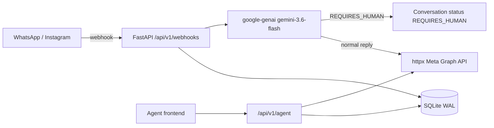

# Meta Chatbot Backend

Proof of Concept backend for an AI-powered **WhatsApp** and **Instagram** chatbot with human handoff. Incoming Meta webhooks are stored in SQLite, answered by **Google Gemini**, and escalated to a human agent API when the model emits `[REQUIRES_HUMAN]`.

## Architecture



1. Meta verifies the webhook (`GET`) and posts inbound events (`POST`).
2. The backend upserts a `User` + `Conversation`, stores the `Message`, and loads recent history.
3. Gemini generates a short messaging-style reply. If the text contains `[REQUIRES_HUMAN]`, the conversation is flagged and **no automated reply is sent**.
4. Human operators list conversations, read history, send a manual reply (which pauses the bot), and toggle the bot back on.

## Project layout

```
.
├── Dockerfile
├── docker-compose.yml
├── requirements.txt
├── .env.example
├── backend/app/
│   ├── main.py              # FastAPI factory, CORS, lifespan
│   ├── config.py            # Pydantic Settings
│   ├── api/                 # /webhooks and /agent routers
│   ├── db/                  # engine (WAL), session, models
│   ├── models/              # re-exported ORM models
│   └── services/            # Gemini engine + Meta client
└── tests/
```

## Prerequisites

- Python 3.11+
- A [Google AI Studio](https://aistudio.google.com/apikey) API key (free tier)
- A Meta app with WhatsApp Cloud API and/or Instagram Messaging, plus a webhook verify token
- Docker (optional, for containerized runs)

## Local setup

```bash
python -m venv .venv
# Windows: .venv\Scripts\activate
# macOS/Linux: source .venv/bin/activate
pip install -r requirements.txt
copy .env.example .env   # Windows
# cp .env.example .env   # macOS/Linux
```

Edit `.env` and set at least:

- `GEMINI_API_KEY`
- `META_VERIFY_TOKEN` (must match the token you configure in the Meta Developer Console)
- `META_ACCESS_TOKEN`, `PHONE_NUMBER_ID`, `INSTAGRAM_ACCOUNT_ID` for outbound messages

Run the API from the repository root (`--app-dir backend` keeps imports working without extra env vars):

```bash
python -m uvicorn app.main:app --app-dir backend --reload --host 0.0.0.0 --port 8000
```

PowerShell (using the project venv):

```powershell
.\.venv\Scripts\python.exe -m uvicorn app.main:app --app-dir backend --reload --host 0.0.0.0 --port 8000
```

- OpenAPI / Swagger UI: [http://localhost:8000/docs](http://localhost:8000/docs)
- ReDoc: [http://localhost:8000/redoc](http://localhost:8000/redoc)
- Health check: [http://localhost:8000/health](http://localhost:8000/health)

SQLite is created at `./data/app.db` with **WAL mode** enabled for concurrent readers.

## Docker

```bash
copy .env.example .env
docker compose up --build
```

The container serves the API on port `8000` and mounts `./data` to `/data` so `sqlite:////data/app.db` survives restarts.

```bash
docker compose down
```

## Tests

```bash
python -m pytest
python -m pytest -q
python -m pytest tests/test_integration.py
```

PowerShell:

```powershell
.\.venv\Scripts\python.exe -m pytest -q
```

The suite uses an in-memory SQLite database and fakes for Gemini and Meta HTTP calls. Coverage includes:

- Webhook verification handshake and WhatsApp/Instagram payload ingestion
- FAQ replies vs `[REQUIRES_HUMAN]` handoff parsing
- Agent listing, manual reply dispatch, and bot toggle
- End-to-end webhook → persistence → automated send / handoff skip

## HTTP API

### Meta webhooks — `/api/v1/webhooks`

| Method | Purpose |
| --- | --- |
| `GET` | Verification: `hub.mode`, `hub.verify_token`, `hub.challenge` |
| `POST` | Inbound WhatsApp Cloud API and Instagram Graph API events |

Point the Meta webhook callback URL at `https://<your-public-host>/api/v1/webhooks`.

### Agent API — `/api/v1/agent`

| Method | Path | Purpose |
| --- | --- | --- |
| `GET` | `/conversations` | List conversations. Query: `status`, `channel`, `skip`, `limit` |
| `GET` | `/conversations/{id}` | Conversation + user metadata |
| `GET` | `/conversations/{id}/messages` | Chat history |
| `POST` | `/conversations/{id}/reply` | Body `{"text": "..."}` — send via Meta and pause the bot (`REQUIRES_HUMAN`) |
| `POST` | `/conversations/{id}/toggle-bot` | Body `{"status": "BOT_HANDLED" \| "DISABLED"}` |

`status` values: `BOT_HANDLED`, `REQUIRES_HUMAN`, `DISABLED`.  
`channel` values: `whatsapp`, `instagram`.

## Human handoff

The Gemini system instruction tells the model to prefix replies with `[REQUIRES_HUMAN]` when the user:

- asks for a human / agent
- raises a complex issue (refunds, billing, legal, account takeover)
- shows high frustration

The engine strips the flag. If it is present, conversation status becomes `REQUIRES_HUMAN` and **no bot message is dispatched**. Human replies keep the bot paused until an operator posts `toggle-bot` with `BOT_HANDLED`.

## Environment variables

See `.env.example`. Notable keys:

| Variable | Description |
| --- | --- |
| `GEMINI_API_KEY` | Google AI Studio key |
| `GEMINI_MODEL` | Defaults to `gemini-3.6-flash` (falls back to `gemini-3.5-flash`) |
| `META_ACCESS_TOKEN` | Graph API user/system token |
| `META_VERIFY_TOKEN` | Webhook verify token |
| `PHONE_NUMBER_ID` | WhatsApp Cloud API phone number ID |
| `INSTAGRAM_ACCOUNT_ID` | Instagram professional account ID |
| `DATABASE_URL` | Default `sqlite:///./data/app.db` |

## Notes for production hardening

This is a PoC. Before production traffic, add Meta `X-Hub-Signature-256` validation, agent authentication, background webhook processing, rate limiting, and a networked database (PostgreSQL) if you outgrow SQLite.
